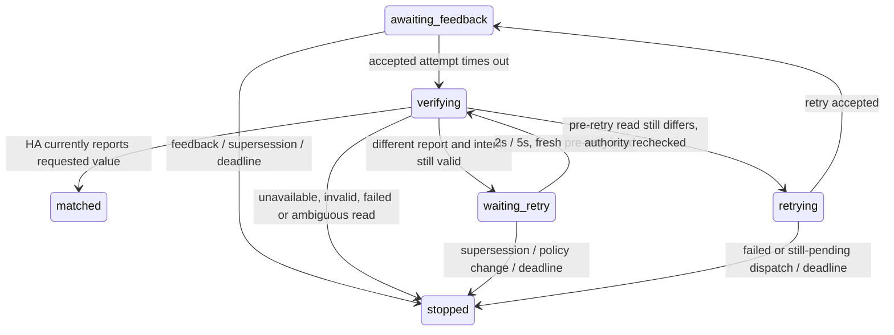

# Music

Lugn controls configured Home Assistant `media_player.*` entities through
explicit semantic targets such as `music.room`. It does not currently use a
direct WiiM network protocol. Available operations depend on the HA integration
behind the mapped entity.

## Dashboard controls

The custom room dashboard provides:

- **Spotify DJ** — play configured preset 1.
- **Optical** — play configured preset 4, useful for the optical input.
- Play/pause.
- Volume down/up in 5 percentage-point steps.

The capability API includes `music.getState`, `music.getPolicy`, `music.play`, `music.pause`,
`music.setVolume` (0..1), `music.fadeVolume`, `music.cancelFade`, and
`music.selectSource`. Fade requests use `{ target, volume, durationMs }`, with a
1 second to 2 minute duration. Source names must appear in the target's
configured `sources` allowlist; copy their exact spelling from the entity's
Home Assistant `source_list`. An empty allowlist disables source changes. The
bridge uses fixed media-player services documented by
[Home Assistant](https://www.home-assistant.io/integrations/media_player/).

The preset numbers can be changed under each `homeAssistant.music` mapping.
Each target can also have an allowlist of exact source names copied from its
Home Assistant `source_list`. The dashboard targets the first configured music
player and does not expose a source selector.

Preset requests use Home Assistant's `wiim.play_preset` action with the mapped
`entity_id` and configured numeric `preset`. The mapped integration must expose
that action. Lugn does not send preset numbers through `media_player.play_media`.

These are explicit user actions. They remain available when HA reports the
resident away; the away gate controls automatic music actions.

### Volume fades

Fades require an available target and a volume observation no older than the
command feedback timeout. The controller interpolates bounded steps (at most
50, no faster than every 250 ms), sends each as a normal volume command, and
waits for that command to be confirmed by the existing ledger before sending
the next step. It stops if feedback leaves the expected segment, the target
becomes unavailable, a direct volume request supersedes it, or feedback times
out. A requested duration must allow at least 250 ms per 0.02 volume step (a
full-scale fade therefore needs at least 12.5 seconds). Cancelling stops future
steps; an already dispatched Home Assistant service call cannot be recalled.

The latest fade is exposed at `music.fades[target]` with its start, target,
nominal duration, expected/observed/last-issued volumes, status, settling end,
and a diagnostic reason when it stops early. A completed fade remains in a
2-second settling window before it is marked complete. That window tolerates
late observations around the target, but a move outside the 0.02 tolerance
marks the fade interrupted. An overall duration-plus-30-second deadline and
the existing per-command timeout keep a stalled fade bounded. These tolerances
are initial software defaults and need measurement against the real WiiM.

Volume matching allows a difference of 0.005 in Home Assistant's 0..1 scale.
An observation cached from before a request cannot confirm it, and a matching
observation only proves that HA reported the expected value. The volume policy
tracks authority separately from attribution: explicit/manual volume changes
claim temporary ownership and update the user baseline. Automatic policy actions
are attributed to Lugn only when they are allowed. See
[Volume policy](#volume-policy) for the distinction between active owner, last
changer, automatic adjustment, baseline and target.

## Verification after missing feedback

Service acceptance still does not confirm device state. If an accepted command
has no matching subscription feedback by the configured feedback timeout
(10 seconds by default), Lugn reads only its mapped Home Assistant entity with
`GET /api/states/{entity_id}`. This is **Home Assistant's stored entity report**,
not a physical WiiM poll. An unchanged entity may legitimately have an update
timestamp older than the command; a read older than a newer known report is
rejected. The read does not emit a subscription observation or advance its
watermarks, change volume ownership/baseline, clear Pause, or confirm a preset.

The original command carries optional typed `recovery` metadata: stage,
`attemptCount` (initial attempt plus at most two retries), `lastAttemptAt`,
`deadlineAt`, `nextAttemptAt`, `stopReason`, and the separate `reported` values
and `verifiedAt` time. A matching read ends recovery at `matched`; the command
remains `unconfirmed`, because a current HA match does not prove what caused it.
Ordinary matching feedback can still confirm through the existing controller.

The bounds are fixed, without new configuration:

- At most **two extra attempts**, only for absolute volume or Play/Pause.
  Backoff is **2 seconds before retry 1**, then **5 seconds before retry 2**.
  Each retry gets another fresh read before dispatch; there are at most five
  reads per original command. Reads and retry dispatches do not overlap.
- Each read has a **5-second timeout**. All recovery work has one **60-second
  deadline from original issue**, enforced with the monotonic clock, including
  pending reads, dispatch acceptance and feedback waits. If dispatch was still
  pending when its feedback wait expired, later acceptance cannot start recovery.
  Abort signals bound HA requests; late continuations are discarded even if a
  custom adapter does not honor cancellation.
- Source commands get verification only. Presets can expose reported playback
  status but cannot confirm the selected preset and are never resent. Fade
  steps keep their own bounded feedback lifecycle and never enter this recovery.
  Adapters without optional `readStatus` retain `unconfirmed` with the typed
  `read_unavailable` reason; Lugn does not blindly resend.

Authority is checked before and after reads, after backoff, and synchronously
before dispatch, including after state-publication subscribers run. New direct
or physical intent invalidates old work through per-target generations that
outlive equal timestamps and pruned command history. Playback, preset and source
requests share an ordering domain; volume, fade replacement/cancel and physical
volume use the independent volume domain. Recovery dispatches preserve the
original manual intent and absence deadline rather than creating another hold.

A change between two known available source values also cancels playback recovery,
even if playback and HA `last_changed` stay unchanged. Verification compares the
source against the original request's known source, including on its first read;
that read cancels only recovery and does not create subscription intent or a
Play/Pause hold. Null/unknown sources and title-only updates do not establish a
source change. A recent source/preset request cannot prove that it caused a later
source report, so this cancellation is conservative even for a possible delayed
Lugn echo. Ordinary source confirmation and accepted late Pause attribution still
apply; source cancellation itself neither creates nor clears manual Pause or
volume ownership. A separately attributed physical Play/Pause retains its existing
policy behavior.

Human Play/Pause remains independent from volume and usable while away/unknown.
Human volume retries require the same live manual hold. Explicit automation
handback cancels them; temporary BILRESA all-off/restore retains a valid hold.
Automatic volume additionally requires occupied/non-away/enabled policy and the
same person/day target and context. Automatic Play requires occupied/non-away,
06:00–23:00 Stockholm time, a clear Pause hold and the original entry context.
An automatic empty-room Pause is retried only while still confirmed empty; an
away Pause only while still away. Unknown, return or home recovery cancels old
work, even without a replacement command. Repeated identical samples do not
renew the recovery deadline. A different HA read whose change timestamp is
newer than the original intent is ambiguous physical intent; Lugn stops rather
than overwriting it. Read/dispatch failures also stop this recovery. Normal room
policy may independently evaluate later fresh commands; the attempt cap applies
to this original command's recovery lifetime.

The dashboard command status (visible alongside the primary controls and in the
music view) explains checks, attempts and stop reasons. **HA-kontroll** identifies
the separate read result. The main reported volume/playback still comes from the
subscription; when a newer disagreeing read exists, that volume is labelled
**Senast**. A newer subscription observation restores its ordinary freshness
label. Neither value claims physical or causal confirmation.

Recovery is **process-local** and is not persisted or replayed after restart.
The existing durable manual volume/Pause intent and continuity policies remain
unchanged. Disposal cancels timers and invalidates pending continuations. Actual
HA/WiiM timing and physical behavior remain subject to the protocol below and
[Music verification](MUSIC-VERIFICATION.md).

## Automatic playback rules

1. A confirmed room-empty transition pauses each configured player and records
   whether it was playing so a short return can preserve continuity.
2. A confirmed room-entry transition from `confirmed_empty`, from 06:00 until 23:00
   Europe/Stockholm time, resumes the recent playing context when it is still
   within 20 minutes. Otherwise, if nothing is playing, it starts Spotify DJ
   preset 1.
3. From 23:00 until 06:00 (Europe/Stockholm), including after midnight, Lugn
   does not automatically start or resume playback. Reaching 06:00 alone
   does not start music; a new eligible entry is required.
4. A Home Assistant `away` observation immediately pauses currently playing
   music, prevents later presence-driven starts/resumes, and cancels automatic
   volume adjustments. Returning to `home` or `unknown` while the room is occupied
   restores eligible volume policy, but does not itself start music or clear a
   manual volume hold.
5. Home status `unknown` is not treated as away and therefore does not gate the
   room-presence policy. It is shown separately on the dashboard.

Manual play, pause and preset requests still work while away. A confirmed-empty
room continues to pause music regardless of home status.

An explicit user Pause cancels automatic resume eligibility immediately, even
if playback feedback is delayed or the room is already empty. Room re-entry
does not resume or start a preset until the user explicitly plays or starts a
preset again, or a genuinely newer physical Playing transition is observed.
Metadata-only Home Assistant updates keep the reported state visible but do not
cancel that Pause, including after command timeout or history pruning. Playback
transition ordering uses `last_changed`, rather than attribute-update time
`last_updated`. Physical pauses also cancel automatic resume eligibility.

## Volume policy

The automatic volume offset uses Europe/Stockholm local time and is applied
while the room is occupied and the resident is not confirmed away:

| Time              |   Daily offset from baseline |
| ----------------- | ---------------------------: |
| 00:00             |        −15 percentage points |
| 03:00             |       −7.5 percentage points |
| 06:00–22:00       |                     0 points |
| 23:00             |       −7.5 percentage points |
| Approaching 00:00 | falls linearly to −15 points |

The curve rises linearly from −15 points at midnight to baseline at 06:00, stays
at baseline through 22:00, then falls linearly back to −15 points at midnight.
When the STL27L snapshot count is greater than one, Lugn subtracts a further
10 points. An unknown count adds no person offset. These adjustments stack and
the automatic result is clamped to 5–80%.

Dashboard volume changes set a new user baseline after accounting for the
current automatic offset. Thus a manual `+` or `−` remains a five-point step
even when the daily curve is active.

Explicit volume requests from a dashboard/user, physical remote or Home Assistant,
and attributed external WiiM/HA volume changes claim **manual volume ownership**.
While that ownership is valid, no automatic volume command or fade step may run,
including minute ticks, person-count changes and evening/night offsets. Human
volume commands and fades remain available even when automation is disabled,
presence is unknown or HA reports away. Adapter rejection or missing confirmation
does not cancel the human hold or prove that the requested volume was reached.
The calculated automatic target remains inspectable as a counterfactual during
the hold; it is not a command to the player.

Ownership transitions are deterministic:

| Event                                                                                 | Volume ownership behavior                                                                                                                                                                                    |
| ------------------------------------------------------------------------------------- | ------------------------------------------------------------------------------------------------------------------------------------------------------------------------------------------------------------ |
| Human volume request or attributed external change                                    | Manual ownership begins; newer intent replaces the baseline.                                                                                                                                                 |
| Human fade begins                                                                     | Manual ownership begins immediately; its destination is committed after successful settling, otherwise its actual terminal volume is used. Newer human intent takes precedence over a stale fade completion. |
| First confirmed-empty event in an absence                                             | Start one absolute 20-minute continuity deadline.                                                                                                                                                            |
| Repeated empty, empty → unknown → empty, or HA home/away                              | Preserve that deadline; do not extend it.                                                                                                                                                                    |
| Occupied before the deadline                                                          | Preserve manual ownership and volume; cancel the absence countdown.                                                                                                                                          |
| Exact deadline or later                                                               | Release the old manual hold. Send no volume command until room presence is occupied and HA is not away. Keep the baseline for the next eligible policy calculation.                                          |
| Unknown without a preceding confirmed absence                                         | Suspend automatic adjustments without starting a countdown or clearing manual intent.                                                                                                                        |
| Dedicated automatic-volume enable from disabled                                       | Deliberately hand volume back to automation; keep playback Pause independent.                                                                                                                                |
| BILRESA long-press all-off mode restore                                               | Restore the prior enable setting without surrendering a valid manual hold.                                                                                                                                   |
| New human intent after an absence deadline has expired, while still absent or unknown | Claim a fresh bounded 20-minute hold without renewing playback resume eligibility. Repeated empty observations do not extend the fresh hold.                                                                 |

Explicit Play, Pause and preset selection do not change volume ownership. The
manual Pause hold does not expire with the volume continuity window. Disabling
automation, confirmed empty/away, and room presence `unknown` cancel future
automatic fade steps; intentional human fades are still allowed. A human fade
crossing an absence deadline may finish intentionally, but its completion does
not recreate the expired hold. An already dispatched HA service call cannot be
recalled.

The backend volume snapshot exposes `activeOwner`, `lastIntentActor`, `policyEnabled`,
`policyActive`, a typed `activityReason`, and `manualHold` with provenance, creation
time, exact requested volume and optional expiry. `lastIntentActor` records the
latest authorized volume intent, not a claim that the player changed; acceptance
and confirmation remain separate in the command ledger. `effectiveTarget` is the
current owner's destination, while `target` remains the calculated automatic
target. Activity is false for valid manual ownership, disabled
policy, unknown/empty room presence, away status, active fades and unavailable
volume observations. Reads do not mutate the baseline or ownership. Legacy
`controller` and `automatic` fields remain for existing clients.

Dedicated enable clears a temporary hold but preserves an already active human
fade until its terminal state. Competing automatic volume requests are blocked
for that fade's lifetime; its completion does not recreate the surrendered hold.

`state.music.volumeChanges[target]` separately records the last reported volume
change, its observation time, provenance and attribution. Initial seeding,
command acceptance and exact same-volume metadata updates do not invent a change.
`correlated` means feedback names a known matching command; `matched` means its
value/timing matches tracked intent without causal correlation; `external` means
there is no such match. A matched report is not proof that Lugn caused the change.
Delayed automatic feedback can remain the last reported changer while valid
manual ownership still prevents every new automatic adjustment. Reported changes
include small differences below the existing manual-ownership noise tolerance.

The playback policy snapshot exposes typed `activityReason`, `entryEligible`,
`quietHours`, the independent `manualPause` hold and a live `resumeExpiresAt`.
`entryEligible` means an automatic action is permitted on the **next fresh
confirmed entry from empty**, not that playback is currently active or may start
immediately. It can be true while the room is empty and waiting for entry.
Occupied startup/repeated occupancy waits for a new entry. Pause, away, unknown
room presence and quiet hours suppress eligibility; quiet hours are 23:00–06:00
in Europe/Stockholm. Availability suppression matches the existing restored
continuity guard; ordinary playback entry does not acquire a new availability
rule. The volume enable switch does not disable playback.

`music.getPolicy` returns the target's volume/playback snapshots, last reported
volume change and typed decision history. The display payload exposes the same
playback snapshots and `generatedAt` for countdowns independent of Hub clock skew.
History is bounded to 128 total music decisions and deduplicates unchanged
ownership, reason, enable state and continuity deadlines. It records evaluated
transitions, not every clock instant: the existing enabled volume-policy minute
tick evaluates quiet-hour reasons, while disabled policy has no periodic volume
evaluation. Unrelated lighting publications do not refresh music history. Reads
do not append history. Report attribution and history are runtime diagnostics,
never persisted or replayed after restart. This covers the music portion of issue
#14; shared lighting/prelight decision history remains a follow-up.

The Hub details distinguish reported and requested volume, the current owner's
effective target, baseline and calculated daily/person adjustments. An unknown
person count remains unknown rather than reusing a stale value.

## Restart and durability

The runtime saves logical music intent in the existing private state file
alongside lighting intent. It retains baselines, exact manual volume destinations,
human provenance and creation times, volume-policy enable state, absolute
confirmed-absence deadlines, independent explicit Pause holds, and the prior
enable setting for BILRESA temporary all-off mode. Restoring that temporary mode
on the next long press preserves a valid manual hold.

Restoration happens before fresh Home Assistant observations. Startup presence,
reported volume and playback remain unknown; requested commands, command history,
positive Play requests and fades are never replayed. A saved manual destination
does not mean that volume was reached, and restoration does not send it to the
player. A fade interrupted by restart keeps its saved human destination and the
last committed baseline; it does not continue fading or claim completion.

Short confirmed absences preserve absolute playback resume eligibility, including
the existing Optical context. After fresh confirmed occupancy, a freshly available
player may resume within that original window; at its exact expiry a new eligible
entry may start the normal preset. Startup, HA seeding/recovery and unknown
presence alone send no restored music commands. The first confirmed-empty
heartbeat may pause playback for safety but does not renew saved deadlines or
resume eligibility. Expired manual ownership is discarded without sending volume
commands, including when its deadline passed during downtime. Repeated restarts
cannot extend an absence.

Explicit Pause does not expire with either continuity window. Its original
timestamp protects it from stale Playing transitions and metadata updates. The
first Playing snapshot after startup or availability recovery preserves Pause,
even if HA advanced `last_changed`; that snapshot cannot prove human Play.
An explicit Play/preset or an attributed newer physical Playing transition after
a known observation baseline can release it. Freshly reported physical states
remain visible while the hold persists.

Persistence uses the existing 150 ms coalescing and atomic private-file write.
Graceful shutdown flushes pending intent. HTTP/service acceptance is not proof of
a durable write: an abrupt kill or power loss during the debounce or in-flight
write can lose the latest change. Completed snapshots survive restart; stronger
per-request durability would require a separate synchronous acknowledgment or
journal. Physical power-loss testing remains pending.

The reader accepts legacy lighting-only version-1 files. Installations with music
write a version-2 envelope; older Lugn binaries reject that envelope and may start
without saved lighting or music intent after rollback. Back up state before
changing versions. Lighting-only installations retain version 1. Invalid music
or changed music target IDs do not discard valid lighting, and invalid new music
write input retains the last valid music section. Neither observations nor
configuration secrets are stored.

## State and command confirmation

The runtime observes playback, volume, source, title and availability from the
initial Home Assistant state query and later WebSocket updates. Service request
acceptance is separate from observed state:

- matching new playback, volume or source feedback can confirm a command;
- commands time out as unconfirmed when no matching observation arrives;
- preset selection is never reported as confirmed because the HA media-player
  state does not expose the selected WiiM preset;
- a successful HA response does not prove that sound is physically audible.

Home Assistant's REST service response does not give this adapter a causal
command context to match later media-player feedback exactly. An accepted
pause that times out remains eligible for matching paused feedback for up to
30 seconds from its latest attempt, so delayed room-empty feedback does not look
like a manual pause. The original issue time still orders it before newer human
playback intent; a retry does not become a new intent.
Selecting a source cancels an old Pause's recovery, while its accepted
feedback retains this one-use attribution window. It must not manufacture a
manual Pause hold or replace a human Pause's original age and provenance.
Newer Play/Pause or preset intent still takes priority.
Newer external playback intent also outlives command history and equal issue
times: after external Play, a later/equal-time Paused report cannot be attributed
to an older accepted Pause. A strictly earlier playback timestamp remains
historical. If HA reports Playing then Paused with the same timestamp,
Lugn conservatively holds Pause; equal-time Playing never releases it, and
repeated Paused metadata does not renew it. Without causal context the tie is
ambiguous, so explicit Play or a genuinely newer Playing transition is required.
Within that bounded window, a separate external pause to the same state can be
indistinguishable; exact attribution requires a correlated Home Assistant
WebSocket service context.

Within the command feedback timeout, the first changed volume observation
matching an accepted, superseded volume request is attributed to that older
request without clearing a newer pending target. This attribution is consumed
once; subsequent physical changes, including a return to that level, remain
external. Without a causal HA context, an external change to that exact older
level can be indistinguishable from its first delayed feedback.

After newer human intent, the first changed observation matching an older
accepted or still in-flight **automatic** volume command is attributed to that command for up to
30 seconds from both the older command's latest attempt and the human intent, including commands
that have already confirmed or timed out. It updates reported volume but cannot
replace the manual baseline or interrupt a newer human fade. Attribution is
consumed once; metadata-only repeats keep ownership unchanged. Explicit command
correlation is honored for retained commands regardless of delay. Once records
are pruned, or outside the uncorrelated window, HA REST cannot distinguish delayed
feedback from a genuinely newer physical change to the same value. Such a change
can update the baseline but never releases a manual hold.

If older automatic feedback and a current human fade step have the same value,
uncorrelated repeats can remain classified as stale. The current fade may then
finish unconfirmed and retain its last trusted volume rather than claim success.
Fresh correlated feedback resolves this ambiguity; the HA REST adapter currently
provides no command correlation. Manual ownership remains in force either way.

Each target must map to a distinct `media_player.*` entity. Preset IDs default
to Spotify DJ `1` and Optical `4`; exact source names are allowlisted per
target. The adapter uses fixed `media_player` services and does not accept an
arbitrary entity ID or service call from a dashboard request.

## Current limitations

See [Music verification](MUSIC-VERIFICATION.md) for deterministic scenario
coverage, reset policies and the unperformed physical-device protocol. Daily
offsets and automatic-start gates use Stockholm wall time at minute resolution;
the curve follows skipped/repeated local hours at DST. Confirmed-absence
deadlines use absolute elapsed milliseconds and retain the same 20-minute
boundary across DST. Manual ownership suppresses volume commands throughout.

- Music control depends on Home Assistant exposing and supporting the needed
  media-player service for the mapped device.
- Preset request confirmation is unavailable from the current HA observations.
- Direct WiiM transport is not implemented. Software fades use Home Assistant
  feedback, but their timing has not been measured against the connected WiiM.
- Automatic behavior is configured for the room-level policy; the dashboard
  does not provide a player/source selector or an automation settings editor.
- Abrupt termination can lose intent not yet durably written; a successful music
  request does not acknowledge persistence. Physical power-loss and exact WiiM
  feedback behavior remain unverified.
- Physical WiiM timing, causal HA feedback attribution and fade trajectory
  tolerances remain unverified. On a test instance, change volume physically
  while occupied, cross 22:00/23:00/midnight/06:00, leave for less than 20 minutes,
  then leave beyond the exact 20-minute boundary. Verify the HA command log has
  no automatic volume commands during the hold, and that only eligible return
  reactivates policy. Also interrupt fades, disconnect/reconnect HA and delay
  service feedback; compare reported volume and command confirmation separately.
